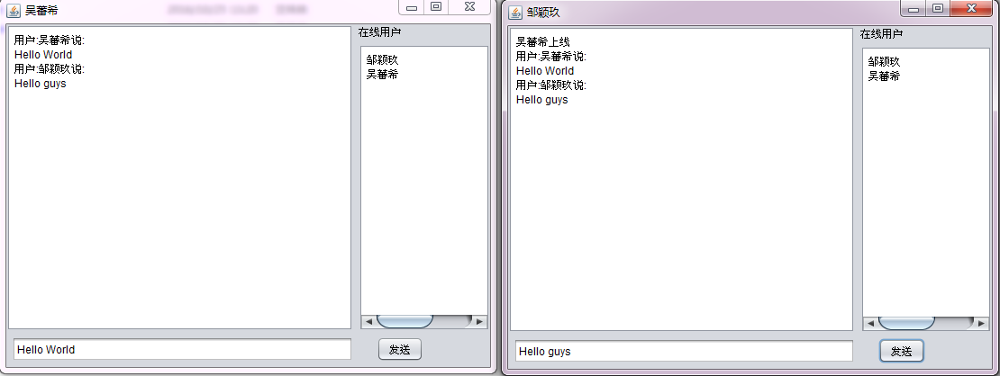

###聊天室的一个demo
整理代码时发现学生时期帮同学写的一个作业，用java编写基于UDP协议的聊天室。

现在回过头看代码，发现代码写的还是蛮有问题的，无奈已有一年多没写过java代码了。只能很惊叹当时这个作业是怎么通过的，印象中当时用NetBeans拖控件做界面不用一个上午就写完了，因为第二天同学要验收。

###消息格式
```
public class Msg {
    String username;    //用户名
    String type;        //协议
    String msg;         //消息体
    String to;          //目标用户(保留关键字)
}

```
设计的传输内容的一个格式为，这个传输格式通用与所有聊天，根据type判断客户端发出的命令
    username:zouyingjiu\ntype:T_LOGIN\nmsg:Hello World\nto:\n
因为没有设计一对一聊天，所以to是保留的，永远不会填充。

###一个运行的截图
